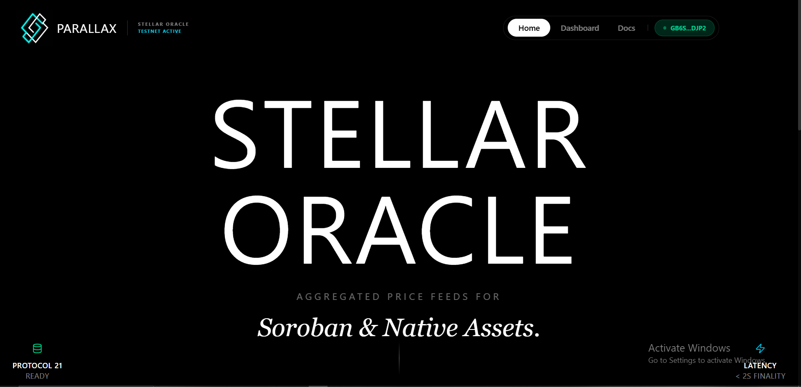
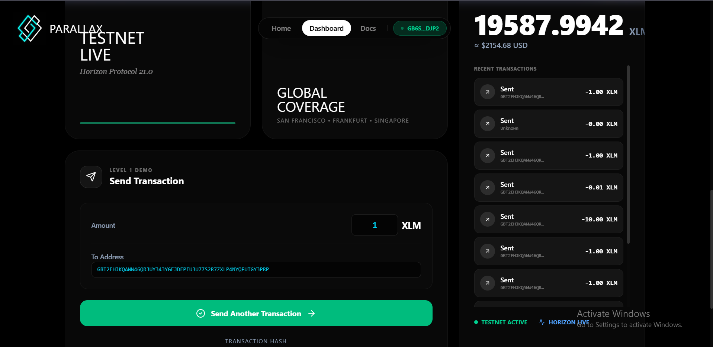

<div align="center">
  
  <h1>Parallax — The Universal Stellar Oracle</h1>
  <p><strong>A premium decentralized application for real-time wallet management and XLM transfers on the Stellar Network.</strong></p>

  <p>
    
    
    
    
    
  </p>
</div>

---

## What is Parallax?

Parallax is a modern, high-performance DApp built on top of the **Stellar blockchain**. It bridges the gap between complex blockchain data and everyday usability — delivering real-time wallet insights, seamless XLM transactions, and live network price feeds inside a single refined interface.

Built as a **Level 1 Stellar Mastery** project for the Rise In Stellar program, Parallax demonstrates core Stellar blockchain integrations: non-custodial wallet authentication, native asset transfers on Testnet, and real-time transaction tracking.

---

## Features

| Feature | Description |
|---|---|
| 🔐 **Wallet Integration** | Secure, non-custodial connection via [Freighter](https://www.freighter.app/) with auto-reconnect on reload |
| 💰 **Live Balance** | Real-time XLM balance with USD equivalent, fetched via Stellar Horizon API |
| 📜 **Transaction History** | Scrollable, live list of your recent incoming/outgoing payments |
| 📤 **Send XLM** | Custom amount input, recipient address, real-time signing and hash tracking |
| 📈 **Price Ticker** | Animated, infinite-scroll banner of live Stellar asset pairs (XLM/USDC, AQUA/XLM, etc.) |
| 🧭 **ScrollSpy Nav** | Navbar active state shifts dynamically between sections as you scroll |

---

## Screenshots

### 🏠 Hero — Wallet Connected
> Landing page with Freighter wallet connected. Note the "Testnet Active" indicator and the truncated public key in the top-right navbar.



---

### 📊 Dashboard — Balance, Transactions & Successful Send
> Dashboard showing live XLM balance, USD equivalent, the Send Transaction form, and the full scrollable transaction history. The green "Send Another Transaction" button confirms a successful testnet payment. The clickable transaction hash appears below the form.



---

## Tech Stack

| Layer | Technology |
|---|---|
| **Framework** | [Next.js 16](https://nextjs.org/) (App Router) |
| **Language** | TypeScript |
| **Styling** | [Tailwind CSS v4](https://tailwindcss.com/) |
| **Animations** | [Framer Motion v12](https://www.framer.com/motion/) |
| **Wallet API** | [@stellar/freighter-api](https://www.npmjs.com/package/@stellar/freighter-api) |
| **Blockchain SDK** | [stellar-sdk](https://github.com/stellar/js-stellar-sdk) |
| **Network** | Stellar Testnet via Horizon API |

---

## Getting Started

### Prerequisites

- **Node.js** v18 or higher — [Download](https://nodejs.org/)
- **Freighter Wallet** browser extension — [Install](https://www.freighter.app/)
  - Make sure it is configured for **Testnet** mode inside the extension settings

### Installation

```bash
# 1. Clone the repository
git clone https://github.com/AyushmanGupta21/Parallax.git
cd Parallax

# 2. Install dependencies
npm install

# 3. Start the development server
npm run dev
```

Then open **[http://localhost:3000](http://localhost:3000)** in your browser.

---

## Usage

### Connecting Your Wallet
1. Click **"Connect Wallet"** in the top-right navbar.
2. Approve the connection request in the Freighter popup.
3. Your public key, XLM balance, and transaction history will load automatically.

> 💡 **Need testnet XLM?** Use the [Stellar Friendbot](https://laboratory.stellar.org/#?network=test) to fund your testnet account for free.

### Sending XLM
1. Connect your Freighter wallet and scroll to the **Dashboard** section.
2. Enter the **amount** of XLM to send.
3. Paste the **recipient's Stellar address** in the "To Address" field.
4. Click **"Confirm XLM Send"** and approve the transaction in Freighter.
5. The transaction hash will appear below the form upon success.

---

## Project Structure

```
parallax/
├── docs/
│   └── screenshots/          # README screenshots
├── public/
│   └── logo.jpeg             # App logo
├── src/
│   ├── app/
│   │   ├── globals.css       # Global styles & Tailwind config
│   │   ├── layout.tsx        # Root layout & fonts
│   │   └── page.tsx          # Home page
│   ├── components/
│   │   ├── BalanceCard.tsx   # Live balance + transaction history
│   │   ├── BentoGrid.tsx     # Dashboard grid layout
│   │   ├── Hero.tsx          # Landing hero section
│   │   ├── Navbar.tsx        # Scrollspy navigation bar
│   │   ├── PriceTicker.tsx   # Animated marquee price feed
│   │   ├── SendXLMForm.tsx   # Transaction builder form
│   │   └── WalletButton.tsx  # Wallet connect/disconnect button
│   ├── hooks/
│   │   └── useFreighter.ts   # Freighter wallet state hook
│   └── lib/
│       └── stellar.ts        # Stellar SDK helpers & Horizon calls
└── README.md
```

---

## License

This project is licensed under the **MIT License**.
