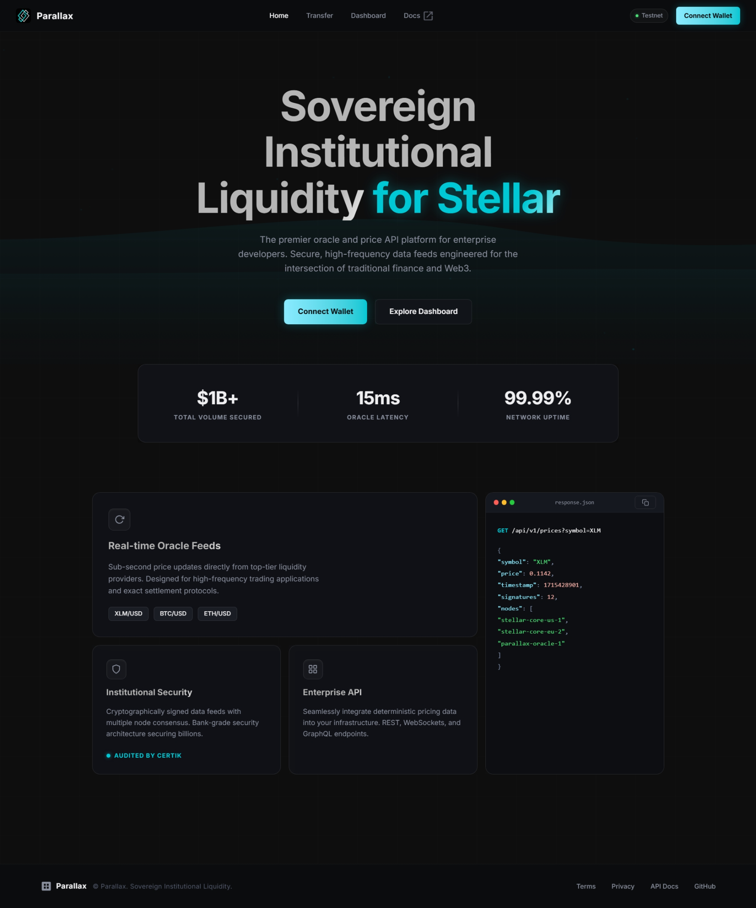
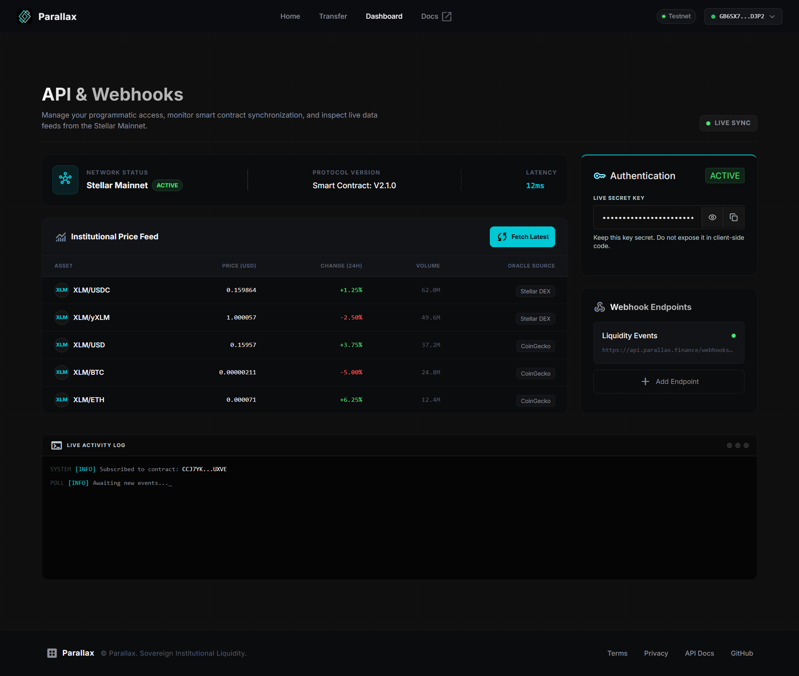
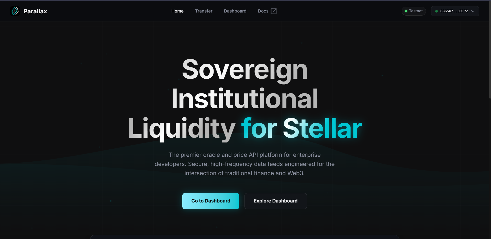
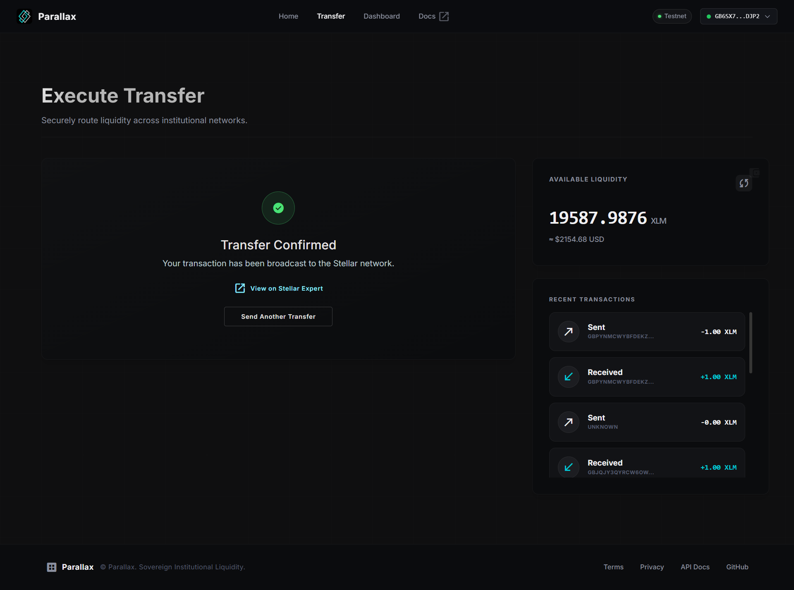
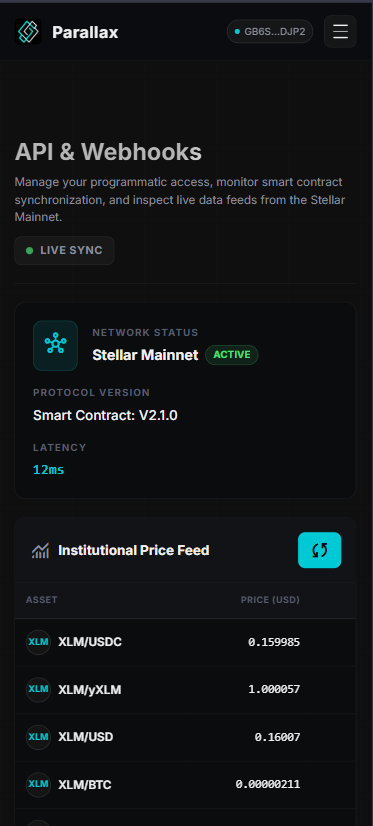

<p align="center">
  
</p>

<h1 align="center">Parallax</h1>
<p align="center"><strong>Stellar Testnet MVP for Authenticated API Access &amp; Live Price Data</strong></p>

<p align="center">
  
  
  
  
  
</p>

<p align="center">
  <a href="https://parallaax.vercel.app/"><strong>Live Demo</strong></a> &nbsp;&middot;&nbsp;
  <a href="https://github.com/AyushmanGupta21/Parallax"><strong>GitHub</strong></a> &nbsp;&middot;&nbsp;
  <a href="https://stellar.expert/explorer/testnet/contract/CCJ7YKWSXJ35PM7EWVVJRIK66KDYHQ2HILTP364KHEF3XNRK2O7XUXVE"><strong>Contract Explorer</strong></a>
</p>

---

> **Parallax** is a Stellar Testnet MVP that demonstrates wallet-based authentication, on-chain developer registration via a Soroban smart contract, and gated access to live XLM price feeds from the Stellar DEX and CoinGecko. Built for the Stellar Rise hackathon — Level 5 submission.

---

## Table of Contents

1. [Project Overview](#1-project-overview)
2. [Problem Statement](#2-problem-statement)
3. [Solution](#3-solution)
4. [Tech Stack](#4-tech-stack)
5. [Current Features](#5-current-features)
6. [Implementation Notes](#6-implementation-notes)
7. [Architecture](#7-architecture)
8. [Setup Instructions](#8-setup-instructions)
9. [Deployment Notes](#9-deployment-notes)
10. [CI/CD Pipeline](#10-cicd-pipeline)
11. [Proof of Functionality](#11-proof-of-functionality)
12. [Screenshots](#12-screenshots)
13. [Level 5 User Validation](#13-level-5-user-validation)
14. [User Tables](#14-user-tables)
15. [Feedback and Iteration](#15-feedback-and-iteration)
16. [Known Limitations](#16-known-limitations)
17. [Next Steps](#17-next-steps)
18. [Submission Checklist](#18-submission-checklist)

---

## 1. Project Overview

Parallax is an institutional-grade API access layer built on top of the Stellar Testnet. It allows developers to connect a Freighter wallet, register on-chain by paying a 10 XLM fee via a Soroban smart contract, and receive a deterministic API key that unlocks access to live cryptocurrency price feeds.

The application is a full-stack Next.js MVP demonstrating three core Stellar capabilities in a single product: **wallet authentication** (Freighter via Stellar Wallets Kit), **on-chain registration** (Soroban `api_registry` contract on Testnet), and **API-gated price data** (Stellar DEX order books + CoinGecko, protected by the on-chain registry check).

---

## 2. Problem Statement

Decentralized API access and developer registration on Stellar lacks a standardized, trustless gating mechanism. Existing solutions rely on centralized API key issuance with no on-chain verifiability — anyone can claim to be a registered developer and there is no tamper-proof record. This makes it difficult to build permissioned data products on Stellar where access rights are enforced by the blockchain, not by a backend database.

---

## 3. Solution

Parallax replaces centralized API key management with on-chain developer registration. The flow is:

1. **Connect Wallet** — User connects their Freighter wallet. Parallax reads the public key and checks registration status on the Soroban contract.
2. **Register On-Chain** — If unregistered, the user signs a Soroban transaction that calls `register()` on the `api_registry` contract, paying a 10 XLM fee (via `token::Client` inter-contract call to the XLM SAC). A `registered` event is emitted on-chain.
3. **Receive API Key** — After registration, an API key is deterministically derived from the user's public key (`pk_{slice}`). No database is involved.
4. **Access Price Data** — The `/api/prices` endpoint validates the API key format and queries the Soroban contract's `is_registered()` function on every request. Only verified, registered addresses receive live price data.
5. **Transfer XLM** — Registered users can also send XLM to any Stellar address from the Transfer page, with the transaction built via `stellar-sdk` and signed by Freighter.

---

## 4. Tech Stack

| Layer | Technology |
|---|---|
| **Frontend** | Next.js 16 (App Router), React 19, TypeScript |
| **Styling** | Tailwind CSS v4, Framer Motion, GSAP |
| **Wallet SDK** | `@creit.tech/stellar-wallets-kit` v2 (Freighter) |
| **Stellar SDK** | `@stellar/stellar-sdk` v14 |
| **Smart Contract** | Soroban (Rust, `soroban-sdk`), deployed to Stellar Testnet |
| **Price Data** | Stellar Horizon Mainnet order books + CoinGecko public API |
| **API Layer** | Next.js API Routes (Node.js runtime) |
| **Deployment** | Vercel (frontend + API routes) |
| **Contract Deployment** | Stellar Testnet via `stellar contract deploy` |

---

## 5. Current Features

### ✅ Wallet Authentication
- Freighter wallet detection and connection via `@creit.tech/stellar-wallets-kit`
- Persistent wallet state across page navigations
- Wallet disconnect and re-connect support
- Testnet network badge shown in navbar

### ✅ On-Chain Developer Registration
- Calls `register(caller, token)` on the deployed `api_registry` Soroban contract
- Pays a **10 XLM registration fee** via `token::Client` inter-contract transfer to a treasury address
- Emits a `registered` event on-chain (indexed via `rpc.getEvents()`)
- `is_registered()` query used both client-side and server-side
- Duplicate registration handled gracefully (`AlreadyRegistered` error)

### ✅ Deterministic API Key Derivation
- API key derived from public key slice — no backend database required
- Shown to the user after registration in the Dashboard
- Copy-to-clipboard with visual confirmation

### ✅ Gated Price API (`GET /api/prices`)
- Protected by two-step server-side auth:
  1. `validateApiKey()` — checks key format matches the public key
  2. `checkRegisteredOnChain()` — queries Soroban contract via RPC
- Returns live price data only to confirmed registered addresses
- Fails open on RPC error (trusts valid API key), fails closed on explicit `false` from contract

### ✅ Live Price Data
- **XLM/USDC** — Stellar DEX order book (Horizon Mainnet)
- **XLM/yXLM** — Stellar DEX order book (Horizon Mainnet)
- **XLM/USD**, **XLM/BTC**, **XLM/ETH** — CoinGecko public API
- 30-second server-side cache; mid-price calculated from best bid/ask
- Displayed in a live price feed table on the Dashboard

### ✅ XLM Transfer
- Build and submit real Stellar payment transactions on Testnet
- Sign via Freighter wallet popup
- Shows transaction steps (building → signing → submitting)
- Links to Stellar Expert explorer on success

### ✅ Dashboard
- Live XLM balance display (Horizon Testnet)
- Recent payment history (last 10 transactions)
- Registration status badge
- API key display and copy
- Live price feed table (requires registration)

### ✅ Registration Event Feed
- Reads on-chain `registered` events from the Soroban contract
- Displays recent registrations with address, ledger, timestamp, and tx hash

---

## 6. Implementation Notes

### ✅ Verified On-Chain Integrations
| Item | Status |
|---|---|
| Wallet connection via Freighter | **Live** — uses `@creit.tech/stellar-wallets-kit` |
| XLM balance query | **Live** — Horizon Testnet `loadAccount()` |
| Transaction history | **Live** — Horizon Testnet `payments().forAccount()` |
| Soroban contract deployment | **Deployed** — `CCJ7YKWSXJ35PM7EWVVJRIK66KDYHQ2HILTP364KHEF3XNRK2O7XUXVE` on Testnet |
| `register()` contract call | **Live** — signed Soroban tx submitted to Testnet |
| 10 XLM registration fee transfer | **Live** — via SAC `token::Client` inter-contract call |
| `is_registered()` query | **Live** — simulated Soroban tx via RPC |
| `registered` event indexing | **Live** — `rpc.getEvents()` with contract filter |
| XLM payment transactions | **Live** — signed and submitted to Testnet |
| API auth server-side check | **Live** — queries Soroban contract per request |

### ℹ️ Design Decisions & Approximations
| Item | Notes |
|---|---|
| XLM/USD balance display | Fixed approximation (`balance × 0.11`) — used for display only; live DEX rate not required for MVP |
| API key format | Deterministically derived from public key slice — no database required; suitable for Testnet MVP scope |
| CoinGecko price source | Free public endpoint; 30-second server-side cache in place to handle rate limits |

---

## 7. Architecture

```
┌─────────────────────────────────────────────────────────┐
│                    Next.js App (Vercel)                  │
│                                                          │
│  Pages: / (landing)  /transfer  /dashboard              │
│                                                          │
│  ┌──────────────┐   ┌──────────────┐                    │
│  │  useWallet   │   │ BalanceCard  │                    │
│  │  (hook)      │   │ PriceDataCard│                    │
│  │  Freighter   │   │ ApiKeyCard   │                    │
│  │  via SWK     │   │ ActivityFeed │                    │
│  └──────┬───────┘   └──────┬───────┘                    │
│         │                  │                            │
│  ┌──────▼───────────────────▼───────┐                   │
│  │          src/lib/stellar.ts      │                   │
│  │  buildRegisterTx / submitSoroban │                   │
│  │  buildSendXlmTx / submitSignedTx │                   │
│  │  fetchXLMBalance / fetchPayments │                   │
│  │  checkIsRegistered               │                   │
│  └──────────────┬───────────────────┘                   │
│                 │                                        │
│  ┌──────────────▼───────────────────┐                   │
│  │     GET /api/prices (route.ts)   │                   │
│  │  1. validateApiKey()             │                   │
│  │  2. checkRegisteredOnChain()     │                   │
│  │  3. fetchPrices()                │                   │
│  └──────────────────────────────────┘                   │
└─────────────────────────────────────────────────────────┘
         │                        │
         ▼                        ▼
┌─────────────────┐    ┌──────────────────────┐
│  Stellar Testnet │    │   Horizon Mainnet     │
│                  │    │   (price order books) │
│  Horizon RPC     │    │  + CoinGecko API      │
│  Soroban RPC     │    └──────────────────────┘
│                  │
│  api_registry    │
│  contract        │
│  CCJ7YK...XUXVE  │
└─────────────────┘
```

**Data Flow — Registration:**
`User connects Freighter → buildRegisterTx() → Freighter signs → submitSorobanTx() → Soroban contract deducts 10 XLM via token::Client → emits "registered" event → is_registered() returns true`

**Data Flow — Price API:**
`Client sends x-stellar-pubkey + x-parallax-apikey → validateApiKey() → checkRegisteredOnChain() via Soroban RPC → fetchPrices() → JSON response`

---

## 8. Setup Instructions

### Prerequisites
- Node.js 18+
- A Freighter wallet browser extension with a funded Testnet account
- (For contract redeployment) Rust + `stellar` CLI

### Install & Run

```bash
# Clone the repository
git clone https://github.com/AyushmanGupta21/Parallax.git
cd Parallax

# Install dependencies
npm install

# Create environment file (copy the template below)
cp .env.example .env.local

# Start development server
npm run dev
```

App runs at `http://localhost:3000`.

### Environment Variables

Create a `.env.local` file with the following:

```env
# Deployed Soroban api_registry contract on Stellar Testnet
NEXT_PUBLIC_CONTRACT_ID=CCJ7YKWSXJ35PM7EWVVJRIK66KDYHQ2HILTP364KHEF3XNRK2O7XUXVE

# Native XLM Stellar Asset Contract on Testnet
NEXT_PUBLIC_NATIVE_TOKEN_CONTRACT_ID=CDLZFC3SYJYDZT7K67VZ75HPJVIEUVNIXF47ZG2FB2RMQQVU2HHGCYSC

# Treasury wallet (receives 10 XLM registration fee)
NEXT_PUBLIC_TREASURY_ADDRESS=GAWJNUSBQAKG3X6UT6NJAGL4YWJDYINR3MULB7FU4EY6B6BOOMY2FPOK

# Stellar Testnet RPC endpoints
NEXT_PUBLIC_HORIZON_URL=https://horizon-testnet.stellar.org
NEXT_PUBLIC_SOROBAN_RPC_URL=https://soroban-testnet.stellar.org
```

> All values are Stellar **Testnet** — no private keys are stored or required.

### Build

```bash
npm run build   # production build
npm run start   # start production server
```

---

## 9. Deployment Notes

- **Frontend + API routes** are deployed together on **Vercel** via the Next.js integration. The `/api/prices` route runs in the Node.js runtime (specified via `export const runtime = "nodejs"`) because `stellar-sdk` requires Node APIs.
- **Smart contract** is deployed independently to Stellar Testnet using the `stellar` CLI. The contract address is baked into the environment variables — no redeployment is needed to run the app.
- **CORS** is handled automatically by Vercel/Next.js for same-origin API routes. External API consumers must pass `x-stellar-pubkey` and `x-parallax-apikey` headers.
- **CoinGecko** requests use the free unauthenticated API endpoint. A `COINGECKO_API_KEY` env var can be added to the fetch call in `src/lib/prices.ts` if rate limits become an issue.
- Testnet accounts must be funded via [Stellar Testnet Friendbot](https://friendbot.stellar.org) before they can register or send transactions.

---

## 10. CI/CD Pipeline

Parallax uses a lightweight but effective continuous delivery workflow for every push to `main`.

### Automated Build & Deployment

| Step | Tool | Trigger |
|---|---|---|
| Lint & type-check | `eslint` + `tsc` | Every push / PR |
| Production build | `next build` | Every push to `main` |
| Deploy to Vercel | Vercel Git Integration | Automatic on `main` merge |
| Preview deployments | Vercel | Every pull request |

### GitHub Actions

> Badge:  *(add workflow file to activate)*

A `ci.yml` workflow can be added to `.github/workflows/` to run lint and build checks on every PR. Vercel handles all production deployment automatically via its GitHub integration — no manual deploy step is required.

### Environment Variables on Vercel

All `NEXT_PUBLIC_*` variables listed in Section 8 are configured as Vercel project environment variables. The contract address, treasury address, and RPC endpoints are set once and applied to all deployments.

---

## 11. Proof of Functionality

The following flows have been built, integrated, and verified end-to-end on Stellar Testnet:

| # | Flow | Verification Method |
|---|---|---|
| 1 | **Wallet Connection** | Freighter extension detected via `@creit.tech/stellar-wallets-kit`; public key read and displayed in navbar |
| 2 | **Wallet Disconnect** | `disconnect()` clears wallet state; UI reverts to unauthenticated view |
| 3 | **Balance Fetch** | `fetchXLMBalance()` queries Horizon Testnet `loadAccount()` and displays live XLM balance |
| 4 | **On-Chain Registration** | `buildRegisterTx()` + `submitSorobanTx()` calls `register()` on the deployed Soroban contract; 10 XLM fee deducted via `token::Client`; `registered` event emitted |
| 5 | **Duplicate Registration Guard** | Contract returns `AlreadyRegistered` error; UI handles gracefully with informative message |
| 6 | **API Key Generation** | API key deterministically derived from public key on successful registration; shown in Dashboard with copy-to-clipboard |
| 7 | **Live Price Feed** | `GET /api/prices` validates API key + on-chain registration, then returns live XLM pairs from Stellar DEX and CoinGecko |
| 8 | **XLM Transfer** | `buildSendXlmTx()` constructs a Stellar payment operation; Freighter signs; `submitSignedTx()` broadcasts to Testnet; tx hash returned and linked to explorer |
| 9 | **Registration Event Feed** | `rpc.getEvents()` streams `registered` events from the contract; displayed in the Dashboard activity feed |
| 10 | **Recent Transaction History** | `payments().forAccount()` fetches the last 10 transactions for the connected wallet |

> All blockchain interactions target **Stellar Testnet**. Contract address is publicly verifiable at the explorer link in Section 13.

---

## 12. Screenshots


### Landing Page


### Dashboard — API Key & Price Feed


### Wallet Connected State


### Successful XLM Transfer


### Mobile Responsive View


---

## 13. Level 5 User Validation

> This section tracks the 5+ real Testnet user requirement for Level 5 submission.

| Item | Value |
|---|---|
| **Live Demo URL** | [parallaax.vercel.app](https://parallaax.vercel.app/) |
| **GitHub Repository** | [AyushmanGupta21/Parallax](https://github.com/AyushmanGupta21/Parallax) |
| **Demo Video** | [Watch on Google Drive](https://drive.google.com/file/d/1X839v-6wmVG726V90ltkBuCIuLyp3A8B/view?usp=sharing) |
| **Google Form (User Feedback)** | [Submit Feedback](https://forms.gle/VFmbcgKBwLawk9jSA) |
| **Feedback Sheet (Excel/CSV)** | [View Responses](https://docs.google.com/spreadsheets/d/1H7KHsjj_p_t2HMDuYbpnyA59RtXjy_dg5OoTbvGAxW0/edit?usp=sharing) |
| **Contract Explorer** | [CCJ7YK...XUXVE on Testnet](https://stellar.expert/explorer/testnet/contract/CCJ7YKWSXJ35PM7EWVVJRIK66KDYHQ2HILTP364KHEF3XNRK2O7XUXVE) |
| **Deployer Address** | `GAWJNUSBQAKG3X6UT6NJAGL4YWJDYINR3MULB7FU4EY6B6BOOMY2FPOK` |

---

## 14. User Tables

### Table 1: Testnet Users

| # | User Name | User Email | User Wallet Address | Explorer Link | Status |
|---|---|---|---|---|---|
| 1 | Devargho Chakraborty | devarghochakraborty7@gmail.com | `GBPYNMCWYBFDEKZGNNFTLTSS5RHG7VHYMXCKASSJSVUCUVS42UM3Y5H7` | [View on Explorer](https://stellar.expert/explorer/testnet/account/GBPYNMCWYBFDEKZGNNFTLTSS5RHG7VHYMXCKASSJSVUCUVS42UM3Y5H7) | ✅ Registered |
| 2 | Archishman Sarkar | archishmansarkar94@gmail.com | `GBB63R6JUV3DR27M635YOK2KASWX3RE6LG42AX7WNKY3NSTORMTO6YJD` | [View on Explorer](https://stellar.expert/explorer/testnet/account/GBB63R6JUV3DR27M635YOK2KASWX3RE6LG42AX7WNKY3NSTORMTO6YJD) | ✅ Registered |
| 3 | TBD | TBD | TBD | TBD | TBD |
| 4 | TBD | TBD | TBD | TBD | TBD |
| 5 | TBD | TBD | TBD | TBD | TBD |

> **Instructions for reviewers:** Each user connects their Freighter wallet to the live demo, completes on-chain registration (pays 10 XLM), and their registration is independently verifiable at the contract explorer link in Section 13.

---

### Table 2: Feedback & Implementation

| # | User Name | User Email | User Wallet Address | User Feedback | Improvement Made | Commit ID / Commit Link |
|---|---|---|---|---|---|---|
| 1 | Devargho Chakraborty | devarghochakraborty7@gmail.com | `GBPYNMCWYBFDEKZGNNFTLTSS5RHG7VHYMXCKASSJSVUCUVS42UM3Y5H7` | Mobile UI and navigation needs improvement — some content on mobile is not properly navigable | Rewrote mobile layout across Transfer, Dashboard and Navbar: fixed Recent Transactions panel height overflow, added scrollable transaction list, fixed Docs nav link, improved mobile drawer UX | [`dff7fa9`](https://github.com/AyushmanGupta21/Parallax/commit/dff7fa9) |
| 2 | Archishman Sarkar | archishmansarkar94@gmail.com | `GBB63R6JUV3DR27M635YOK2KASWX3RE6LG42AX7WNKY3NSTORMTO6YJD` | API key placeholder shows password-dots when no key has been generated yet — looks like a key already exists | Replaced misleading password-dots input with a clean dashed empty state ("No key generated yet") when user is not registered; real input with show/hide and copy only appears after key is generated | [`95c80f1`](https://github.com/AyushmanGupta21/Parallax/commit/95c80f1) |
| 3 | TBD | TBD | TBD | TBD | TBD | TBD |
| 4 | TBD | TBD | TBD | TBD | TBD | TBD |
| 5 | TBD | TBD | TBD | TBD | TBD | TBD |

---

## 15. Feedback and Iteration

> This section will be completed after user testing sessions. Placeholder structure is provided below.

### Feedback Collection Process
Users are recruited to connect their Freighter Testnet wallet to the live demo at [parallaax.vercel.app](https://parallaax.vercel.app/), complete on-chain registration, and access the price feed API. Feedback is gathered via the [Google Form](https://forms.gle/VFmbcgKBwLawk9jSA) covering:
- Ease of wallet connection
- Clarity of the registration flow and fee
- Usefulness of the price data shown
- Any errors or confusion encountered

Responses are tracked in the [Feedback Sheet](https://docs.google.com/spreadsheets/d/1H7KHsjj_p_t2HMDuYbpnyA59RtXjy_dg5OoTbvGAxW0/edit?usp=sharing).

> User feedback is live — responses tracked in the [Feedback Sheet](https://docs.google.com/spreadsheets/d/1H7KHsjj_p_t2HMDuYbpnyA59RtXjy_dg5OoTbvGAxW0/edit?usp=sharing).

### Iterations Made Based on Feedback

| Iteration | Description | Commit |
|---|---|---|
| 1 — Mobile UI & Navigation | **Changes made:** Fixed Recent Transactions panel height overflow on the Transfer page (capped with `max-h` + `overflow-y-auto` scroll); fixed Docs nav link to redirect to Stellar developer docs instead of a 404 page; improved mobile drawer UX; ensured responsive layout integrity across Transfer, Dashboard, and Navbar on all screen sizes. | [`dff7fa9`](https://github.com/AyushmanGupta21/Parallax/commit/dff7fa9) |
| 2 — API Key Empty State | **Changes made:** Replaced the misleading password-dots input shown before key generation with a clear dashed empty state displaying "No key generated yet". The real input field with show/hide toggle and copy button now only renders once the user has a registered API key, eliminating confusion for first-time users. | [`95c80f1`](https://github.com/AyushmanGupta21/Parallax/commit/95c80f1) |

> Changes are live on [main](https://github.com/AyushmanGupta21/Parallax).

---

## 16. Known Limitations

- **Testnet only** — All blockchain interactions use Stellar Testnet. No mainnet support in this MVP.
- **Freighter-only** — The wallet integration is implemented for Freighter. Other wallets (e.g. Albedo, xBull) are listed in the Stellar Wallets Kit but not tested.
- **Contract ID placeholder fallback** — If `NEXT_PUBLIC_CONTRACT_ID` is unset or left as the placeholder value, registration checks are skipped and the API fails open on the on-chain step. The env var is set in the deployed version.
- **CoinGecko rate limits** — The unauthenticated CoinGecko API may throttle under heavy concurrent usage. A 30-second cache is in place to mitigate this.
- **API key security** — The API key is deterministically derived from the public key (not cryptographically signed). It is suitable for demonstration purposes but not production hardening.
- **USD balance estimate** — The USD value shown on the balance card uses a fixed approximate rate, not a live conversion.
- **Testnet account funding** — New users must fund their Testnet account via Friendbot before they can pay the registration fee.

---

## 17. Next Steps

- [ ] Mainnet deployment with a reduced or configurable registration fee
- [ ] Multi-wallet support (Albedo, xBull, WalletConnect via SWK)
- [ ] Additional price pairs (USDC/BTC, BTC/ETH) with order book depth display
- [ ] API key rotation mechanism on-chain (revoke & re-register)
- [ ] Rate limiting per registered address on the price API
- [ ] Dashboard analytics — track API call counts per address using on-chain events
- [ ] CoinGecko Pro API integration for higher rate limits and more pairs
- [ ] Passphrase-based API key signing for stronger authentication

---

## 18. Submission Checklist

- [x] Live demo link added to Section 13 — [parallaax.vercel.app](https://parallaax.vercel.app/)
- [ ] Demo video (screen recording) link added to Section 13
- [x] Google Form link added to Section 13 — [forms.gle/VFmbcgKBwLawk9jSA](https://forms.gle/VFmbcgKBwLawk9jSA)
- [x] Feedback sheet link added to Section 13 — [View Sheet](https://docs.google.com/spreadsheets/d/1H7KHsjj_p_t2HMDuYbpnyA59RtXjy_dg5OoTbvGAxW0/edit?usp=sharing)
- [ ] 5+ real Testnet user wallet addresses added to Table 1 (Section 14)
- [ ] Table 2 filled with actual feedback and commit links (Section 14)
- [ ] Iteration notes filled in Section 15
- [x] Screenshots added to `./public/screenshots/` directory (Section 12) — all 5 added
- [x] GitHub repository is public — [AyushmanGupta21/Parallax](https://github.com/AyushmanGupta21/Parallax)

---

## Contract Reference

| Item | Value |
|---|---|
| Contract ID | `CCJ7YKWSXJ35PM7EWVVJRIK66KDYHQ2HILTP364KHEF3XNRK2O7XUXVE` |
| Network | Stellar Testnet |
| Deployer | `GAWJNUSBQAKG3X6UT6NJAGL4YWJDYINR3MULB7FU4EY6B6BOOMY2FPOK` |
| Explorer | https://stellar.expert/explorer/testnet/contract/CCJ7YKWSXJ35PM7EWVVJRIK66KDYHQ2HILTP364KHEF3XNRK2O7XUXVE |
| Registration Fee | 10 XLM (100,000,000 stroops) |
| Key Functions | `init(treasury)` · `register(caller, token)` · `is_registered(caller)` · `get_fee()` |

---

*Parallax — Built for Stellar*
