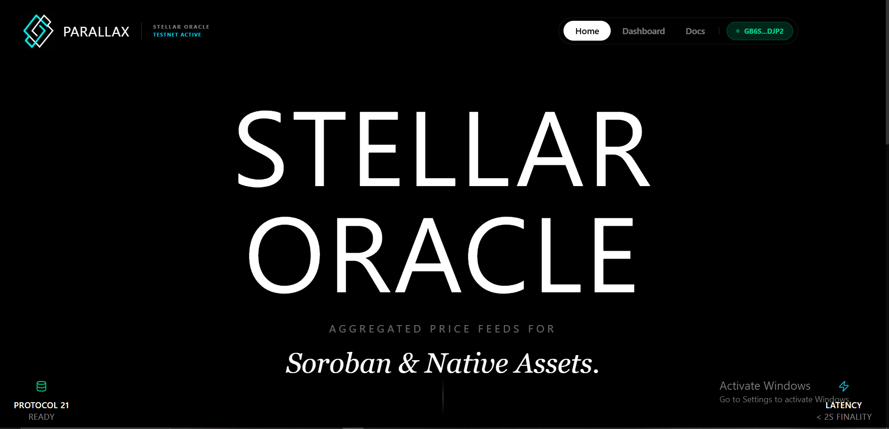
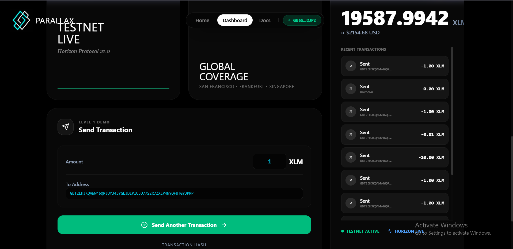

<div align="center">
  
  <h1>Parallax — The Universal Stellar Oracle</h1>
  <p><strong>A production-ready, full-stack decentralized application for real-time price data, wallet management, and XLM transfers on the Stellar Network.</strong></p>

  <p>
    
    
    
    
    
    
  </p>
</div>

---

## What is Parallax?

Parallax is a full-stack developer platform built on the **Stellar blockchain**. It aggregates and indexes real-time price data for native Stellar assets and Soroban tokens, delivering it via a developer dashboard where access control and billing are managed entirely on-chain through **Soroban smart contracts**.

Built as a **Level 4 (Green Belt)** submission for the Rise In Stellar Journey to Mastery program, it demonstrates advanced Stellar capabilities: multi-wallet support, Soroban smart contract deployment, inter-contract token calls, mobile-responsive design, and a full CI/CD pipeline.

**Live Demo:** [parallax-eight-psi.vercel.app](https://parallax-eight-psi.vercel.app)

---

## Features

| Feature | Description | Level |
|---|---|---|
| **Multi-Wallet Integration** | Connect via Freighter, LOBSTR, xBull and more using StellarWalletsKit | L2 |
| **Live Balance** | Real-time XLM balance with USD equivalent via Stellar Horizon API | L1 |
| **Transaction History** | Scrollable live list of recent incoming/outgoing payments | L1 |
| **Send XLM** | Custom amount input with real-time signing and transaction hash tracking | L1 |
| **API Key Registry (Smart Contract)** | Soroban contract call to register a developer address on-chain | L2 |
| **Inter-Contract Token Call** | `register` function transfers 10 XLM via native token contract (Level 4) | L4 |
| **3 Error Types Handled** | Wallet not found, transaction rejected, insufficient balance / already registered | L2 |
| **Transaction Status Tracking** | Building → Signing → Submitting → Success/Error states | L2 |
| **Price Data Feed** | Mock aggregated price data gated by on-chain registration status | L3 |
| **Loading States + Caching** | Spinners on all async ops, registration status cached in localStorage | L3 |
| **Price Ticker** | Animated infinite-scroll banner of live Stellar asset pairs | L1 |
| **ScrollSpy Navigation** | Navbar active state tracks scroll position between sections | L2 |
| **Mobile Responsive** | Fully responsive layout at all breakpoints (375px → 1440px) | L4 |
| **CI/CD Pipeline** | GitHub Actions runs `cargo test` + Next.js build on every push | L4 |

---

## Smart Contract

### Deployed Contract

| Field | Value |
|---|---|
| **Contract ID** | `PLACEHOLDER — update after deploy` |
| **Network** | Stellar Testnet |
| **Explorer** | [View on Stellar Expert](https://stellar.expert/explorer/testnet/contract/PLACEHOLDER) |

### Contract Functions

```rust
// Register a developer (Level 4: inter-contract token transfer of 10 XLM)
pub fn register(env: Env, caller: Address, token: Address) -> Result<(), Error>

// Check if an address is registered
pub fn is_registered(env: Env, caller: Address) -> bool

// Get the registration fee in stroops
pub fn get_fee(_env: Env) -> i128  // returns 10_000_000
```

### Error Types

| Error | Code | Description |
|---|---|---|
| `AlreadyRegistered` | 1 | Address has already registered |
| `NotRegistered` | 2 | Address not yet registered |
| `InsufficientBalance` | 3 | Insufficient token balance for the 10 XLM fee |

---

## Tech Stack

| Layer | Technology |
|---|---|
| **Framework** | [Next.js 16](https://nextjs.org/) (App Router) |
| **Language** | TypeScript + Rust |
| **Styling** | [Tailwind CSS v4](https://tailwindcss.com/) |
| **Animations** | [Framer Motion v12](https://www.framer.com/motion/) |
| **Multi-Wallet** | [@creit.tech/stellar-wallets-kit](https://github.com/Creit-Tech/Stellar-Wallets-Kit) |
| **Blockchain SDK** | [stellar-sdk](https://github.com/stellar/js-stellar-sdk) |
| **Smart Contracts** | [Soroban SDK v22](https://developers.stellar.org/docs/tools/sdks/library) (Rust) |
| **Network** | Stellar Testnet — Horizon API + Soroban RPC |
| **CI/CD** | GitHub Actions |

---

## Getting Started

### Prerequisites

- **Node.js** v18 or higher — [Download](https://nodejs.org/)
- **Rust** with `wasm32-unknown-unknown` target — [Install](https://rustup.rs/)
- **Stellar CLI** — `cargo install --locked stellar-cli`
- **Freighter Wallet** (or any supported wallet) — [Install](https://www.freighter.app/)
  - Configure for **Testnet** mode

### Installation

```bash
# 1. Clone the repository
git clone https://github.com/AyushmanGupta21/Parallax.git
cd Parallax

# 2. Install Node dependencies
npm install

# 3. Copy environment template
cp .env.example .env.local

# 4. Start the development server
npm run dev
```

Open [http://localhost:3000](http://localhost:3000).

### Contract Setup

```bash
# 1. Add the wasm32 target
rustup target add wasm32-unknown-unknown

# 2. Run unit tests (4 tests)
cargo test --manifest-path contracts/Cargo.toml

# 3. Build the contract WASM
cargo build --manifest-path contracts/Cargo.toml \
  --target wasm32-unknown-unknown --release

# 4. Create a testnet identity (if you don't have one)
stellar keys generate --global deployer --network testnet --fund

# 5. Deploy the contract
stellar contract deploy \
  --wasm contracts/target/wasm32-unknown-unknown/release/api_registry.wasm \
  --source deployer \
  --network testnet

# 6. Initialize the contract with a treasury address
stellar contract invoke \
  --id <CONTRACT_ADDRESS> \
  --source deployer \
  --network testnet \
  -- init \
  --treasury <YOUR_STELLAR_ADDRESS>

# 7. Add the contract address to .env.local
echo "NEXT_PUBLIC_CONTRACT_ID=<CONTRACT_ADDRESS>" >> .env.local
```

---

## Usage

### Connecting Your Wallet
1. Click **"Connect Wallet"** in the navbar — a multi-wallet modal will appear.
2. Select your preferred wallet (Freighter, LOBSTR, xBull, etc.).
3. Approve the connection. Your balance and history load automatically.

> **Need testnet XLM?** Fund your account free at [Stellar Friendbot](https://laboratory.stellar.org/#?network=test).

### Generating an API Key
1. Connect your wallet and scroll to the **Dashboard**.
2. Click **"Generate API Key → 10 XLM"**.
3. Approve the contract call in your wallet. This invokes `register()` which makes an inter-contract call to transfer 10 XLM as the registration fee.
4. Your API key will appear once the transaction is confirmed on-chain.

### Fetching Price Data
1. After registering, click **"Fetch Price Data"** in the price card.
2. Data is gated by your on-chain registration status.

---

## CI/CD Pipeline

GitHub Actions automatically runs on every push to `main`:

- **Job 1** — `cargo test` on the Soroban contracts
- **Job 2** — `tsc --noEmit` type check + `npm run build`

View the pipeline: [GitHub Actions](https://github.com/AyushmanGupta21/Parallax/actions)

---

## App Preview

Landing page with multi-wallet connection support and Testnet Active status.



Dashboard showing live XLM balance, API Key Registry card with Soroban contract call, price data feed, and transaction history.



---

## License

This project is licensed under the **MIT License**.
